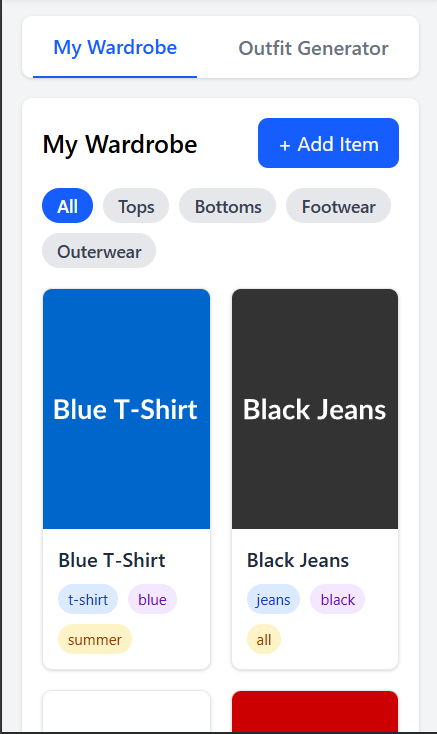

# Virtual Wardrobe App

A responsive web application where users can catalog their clothing items and receive outfit recommendations. Built with React and styled with Tailwind CSS.

## Features

### Core Features
- **Wardrobe Dashboard:** Grid view of clothing items with filtering by category
- **Add Item Functionality:** Upload images and add details like type, color, and season
- **Outfit Generator:** Randomly generates matching outfits from your wardrobe items
- **Responsive Design:** Fully compatible with both desktop and mobile devices

### Bonus Features
- **Weather-Based Outfits:** Toggle to generate outfits suitable for specific seasons
- **Smart Match:** Color compatibility algorithm for better outfit coordination

## Screenshots

### Desktop View

#### Wardrobe Dashboard and Outfit Generator


### Mobile View

<div style="display: flex; justify-content: space-around;">
  <div>
    <p><strong>Mobile Wardrobe</strong></p>
    
  <div>
    <p><strong>Mobile Outfit Generator</strong></p>
    
  </div>
</div>

## How to Run

### Prerequisites
- Node.js (v14.0.0 or higher)
- npm (v6.0.0 or higher)

### Installation

1. Clone the repository
```bash
git clone https://github.com/yourusername/virtual-wardrobe.git
cd virtual-wardrobe
```

2. Install dependencies
```bash
npm install
```

3. Start the development server
```bash
npm start
```

4. Open your browser and navigate to `http://localhost:3000`

### Project Structure

```
src/
├── components/
│   ├── WardrobeGrid.jsx       # Grid display for clothing items
│   ├── ClothingCard.jsx       # Individual clothing item card
│   ├── AddItemForm.jsx        # Form to add new items
│   ├── FilterBar.jsx          # Category filtering component
│   ├── OutfitGenerator.jsx    # Outfit generation controls
│   └── OutfitDisplay.jsx      # Display for generated outfits
├── context/
│   └── WardrobeContext.jsx    # State management with Context API
├── utils/
│   └── outfitUtils.js         # Outfit generation algorithms
├── data/
│   └── mockData.js            # Initial wardrobe data
├── App.jsx                    # Main application component
└── index.js                   # Entry point
```

## Development Details

### Time Spent
- **Setup & Planning:** 2 hours
- **Core Features Implementation:** 10 hours
- **UI/UX Design & Styling:** 5 hours
- **Responsive Design:** 3 hours
- **Testing & Refinement:** 4 hours
- **Bonus Features:** 2 hours
- **Total Time:** 26 hours

### Tech Stack
- **Frontend Framework:** React
- **State Management:** React Context API
- **Styling:** Tailwind CSS
- **Image Placeholders:** placehold.co service

### Future Enhancements
- Local storage integration for data persistence
- Drag and drop interface for manual outfit creation
- More sophisticated outfit matching algorithms
- User profiles and sharing capabilities
- Weather API integration for real-time outfit suggestions

## License
MIT
